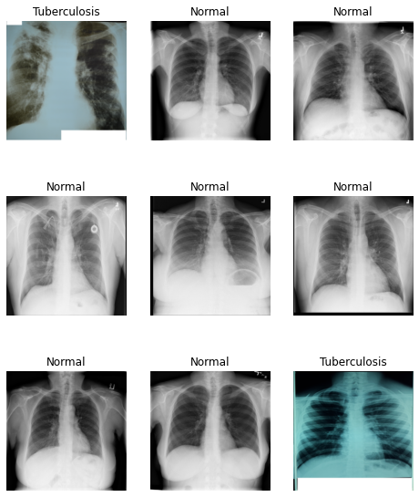
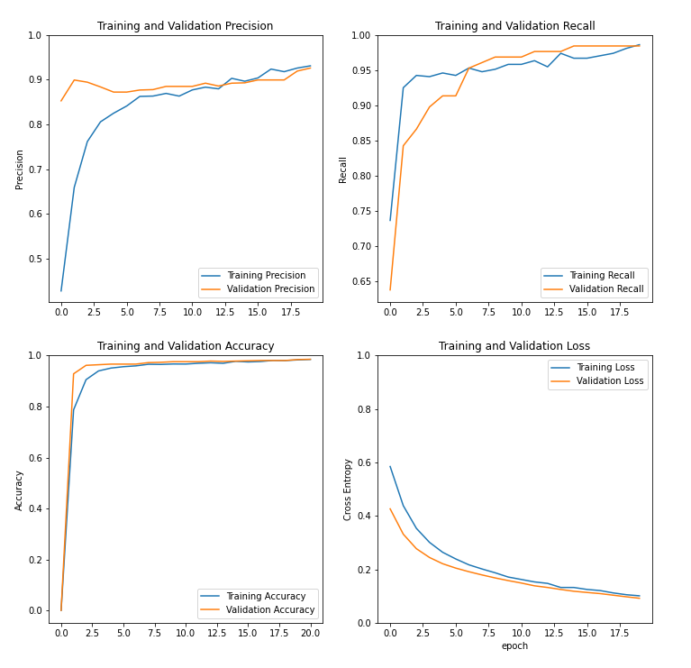

# Tuberculosis Prediction Project

This repo houses the data for the tuberculosis prediction project which includes:
 * The sources code, 
 * The result (fig 1), 
 * Data sample (fig 2)
 * Training notebook: `train.ipynb`
 * Streamlit deployment `files deployment/*`
 * Python script to get the pretrained model: `get_pretrained_model.py`
 * Misci files.

## Data Samples
 
`Figure 1: Sample of TB and non-TB images`

## Result

  
`Figure 2: result of the InceptionNetv3`

## Downloading Model
To get the pretrained model, run the get_pretrained_model.py file